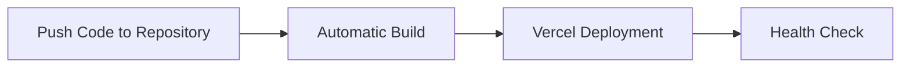
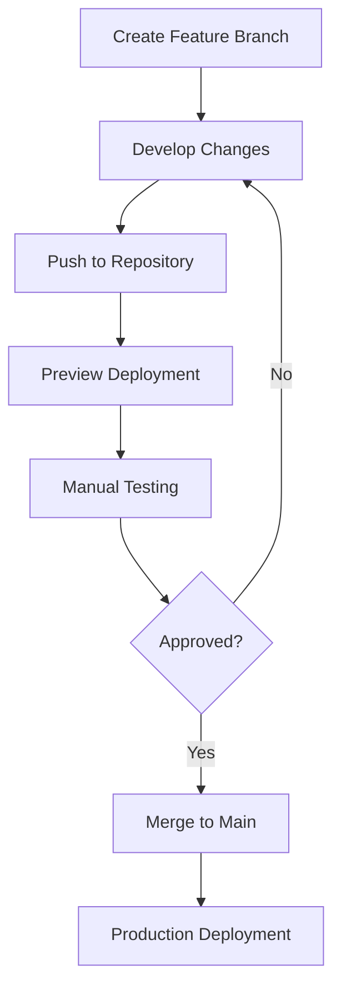

# Setting Up CI/CD with Vercel

This guide will help you set up a Continuous Integration and Continuous Deployment (CI/CD) pipeline for your portfolio website using Vercel.

## Benefits of CI/CD with Vercel

- **Automated Deployments**: Changes are automatically deployed when you push to your repository
- **Preview Deployments**: Every pull request gets its own preview URL
- **Easy Rollbacks**: Quickly revert to previous deployments if issues arise
- **Environment Management**: Separate development, staging, and production environments

## Prerequisites

- A GitHub, GitLab, or Bitbucket repository containing your portfolio code
- A Vercel account (sign up at [vercel.com](https://vercel.com))
- Your SendGrid API key for email functionality

## Setting Up CI/CD Pipeline

### Step 1: Connect Your Repository to Vercel

1. Log in to your Vercel account
2. Click "New Project"
3. Import your Git repository
4. Configure project settings:
   - **Framework Preset**: Other
   - **Root Directory**: ./
   - **Build Command**: npm run build
   - **Output Directory**: dist/public

### Step 2: Configure Environment Variables

In your Vercel project settings, add the following environment variables:

| Variable | Description |
|----------|-------------|
| `SENDGRID_API_KEY` | Your SendGrid API key |
| `CONTACT_FROM_EMAIL` | Email to send from (must be verified in SendGrid) |
| `CONTACT_TO_EMAIL` | Email to receive contact form submissions |
| `RECAPTCHA_SECRET_KEY` | (Optional) For spam protection |

### Step 3: Set Up Branch Deployments

1. Go to your Vercel project settings
2. Navigate to "Git" section
3. Configure the following:
   - **Production Branch**: main (or your default branch)
   - **Preview Branches**: Enable for all branches
   - **Preview Comments**: Enabled (for PR comments)

### Step 4: Configure Deployment Protection

For production deployments, consider adding deployment protection:

1. Go to project settings
2. Navigate to "Git" > "Deploy Hooks"
3. Enable password protection or OAuth verification

## Workflow Examples

### Basic Workflow



### Feature Branch Workflow



## Monitoring Deployments

### Deployment Logs

- Visit your Vercel dashboard
- Select your project
- Click on "Deployments" to view all deployments
- Click on a specific deployment to view detailed logs

### Health Checks

After each deployment, verify that your application is working correctly:

```bash
# Replace with your actual deployment URL
bash scripts/verify-deployment.sh https://your-portfolio.vercel.app
```

### Setting Up External Monitoring

For production deployments, consider setting up external monitoring:

1. **UptimeRobot**: Configure to ping your health endpoint (`/api/health`)
2. **StatusCake**: Set up to monitor your main site and API endpoints
3. **Datadog**: For more comprehensive monitoring and alerting

## Automating Data Updates

If your portfolio data changes frequently, consider setting up a scheduled data extraction:

1. Create a GitHub Action that runs your data extraction script
2. Schedule it to run daily or weekly
3. Commit changes to your repository
4. Vercel will automatically deploy the updated data

Example GitHub workflow:

```yaml
name: Update Portfolio Data

on:
  schedule:
    - cron: '0 0 * * 0'  # Weekly on Sunday at midnight
  workflow_dispatch:     # Allow manual trigger

jobs:
  update-data:
    runs-on: ubuntu-latest
    steps:
      - uses: actions/checkout@v2
      
      - name: Setup Node.js
        uses: actions/setup-node@v2
        with:
          node-version: '20'
          
      - name: Install dependencies
        run: npm ci
        
      - name: Extract data
        run: npx tsx scripts/extract-data-for-frontend.ts
        env:
          MONGODB_URI: ${{ secrets.MONGODB_URI }}
          
      - name: Commit and push if changed
        run: |
          git config --local user.email "action@github.com"
          git config --local user.name "GitHub Action"
          git add data-export/
          git diff --quiet && git diff --staged --quiet || git commit -m "Update portfolio data [skip ci]"
          git push
```

## Troubleshooting Common Issues

### Failed Builds

If your Vercel build fails:

1. Check the build logs in the Vercel dashboard
2. Verify that your project builds locally with `npm run build`
3. Check for missing environment variables

### API Not Working

If your API endpoints aren't working:

1. Verify that your API routes are correctly configured in `vercel.json`
2. Check that your data files are properly included in the deployment
3. Use the verify-deployment script to check all endpoints

### Email Functionality Issues

If contact form emails aren't being sent:

1. Verify that SendGrid API key is correctly set in environment variables
2. Check that sender email is verified in SendGrid
3. Test email functionality locally before deploying

## Best Practices

1. **Use Environment Branch Deployments**: 
   - `main` → Production
   - `staging` → Staging environment
   - Feature branches → Development previews

2. **Add Integration Tests**:
   - Create automated tests for API endpoints
   - Set up end-to-end tests for critical user flows

3. **Implement Gradual Rollouts**:
   - Use Vercel's gradual rollout feature for major changes
   - Set to 10% traffic initially, then increase if no issues

4. **Regular Audits**:
   - Schedule regular performance and security audits
   - Automate dependency updates with Dependabot

---

For more information, refer to the [Vercel Documentation](https://vercel.com/docs) and [GitHub Actions Documentation](https://docs.github.com/en/actions).